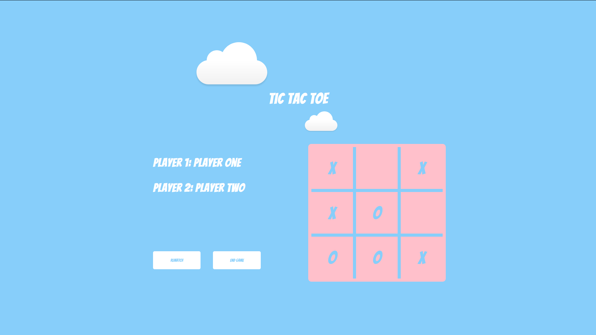

# Tic tac toe with Js

Project for Microverse using Odin project. 

It is built with vanilla Javascript, HTML, and CSS.

The main point of this project is to use modules, factory functions, and to understand how to closures work.

## Getting Started

Just clone the project, and run the HTML in your browser.

Or [view](https://raw.githack.com/edwinmoradian90/tic-tac-toe_js/game-features/index.html) it here.

## Built With

* JavaScipt - Vanilla.
* HTML - You know.
* CSS - Styling.

## Authors

**Edwin Moradian**  | [Github](https://github.com/edwinmoradian90) | [LinkedIn](https://linkedin.com/in/edwin-moradian)

## License

This project is licensed under the MIT License.

